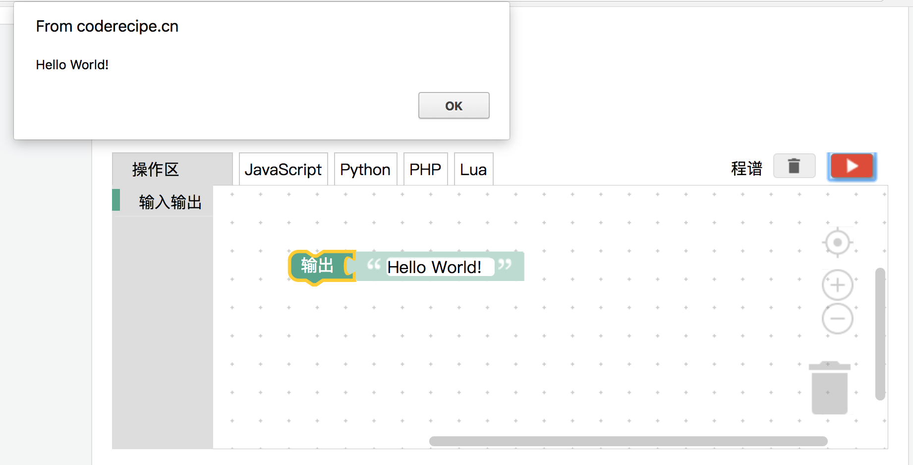
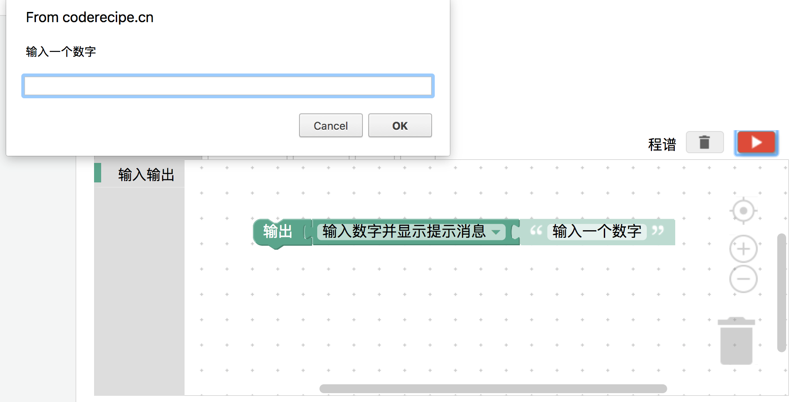
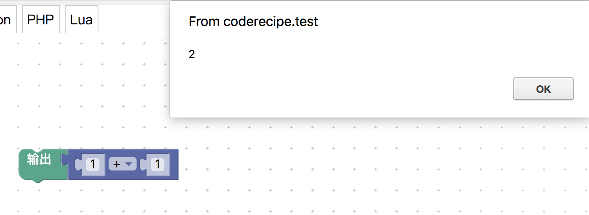

<notice>教程读者请不要直接阅读本文件，因为诸多功能在此无法正常使用，请移步至[程谱 coderecipe.cn](https://coderecipe.cn/learn/1)学习完整教程。如果您喜欢我们的教程，请在右上角给我们一个“Star”，谢谢您的支持！</notice>
初入编程
======

欢迎来到程谱社区！😁 我们是一群留学生，致力于搭建一个系统而又不枯燥的零基础入门编程学习平台。希望大家能多多支持我们，如果发现我们的不足之处也欢迎联系我们~

这是大多数程谱学员的第一个教程，从这里开始学习吧！💖

**P.S**: 还没注册的用户可以点右上角的“注册”来注册一下，这样不仅可以学习整棵知识树而不仅仅是一个教程，而且你学过的知识点就会全部被记录下来，之后就不需要重复学习了哦~

输入&输出
------
如果你是在用电脑阅读这个教程，那么你就正在盯着电脑的显示屏看，偶尔还会滚动一下鼠标滚轮🖱。如果你用的是手机或者平板📱，那么就会通过触摸屏上下滑动网页来阅读教程的内容。

你可能没有注意到，但仔细想想就会发现，我们身边的电子设备大多都可以由我们操控（输入）和告诉我们信息（输出），不只是电脑手机和平板，例如电话☎️能接收和发出声音。思考到这一步，你就已经理解了输入(input)和输出(output)这两个概念了。

之前说的是广义的输入和输出，而对于计算机程序的运行来说，我们先给程序提供必要的数据信息（输入），然后程序进行一系列的运算，再把结果告诉我们（输出），就像下面这张图画的这样：

掌握了吗？如果掌握了，就按一下右下方这个按钮吧~

练习环境小热身
------
下面是练习框，让我们跟着练习框的下方的指示一起来熟悉一下练习环境吧。

<lab lang="blocks" parameters="logic=false&math=false&loops=false&lists=false&color=false&variables=false&functions=false&text=false&name=chapter1lab1">
  <notice>练习环境在此无法显示，请移步至[程谱 coderecipe.cn](https://coderecipe.cn/learn/1)查看。</notice>
</lab>

首先，点击左边的“输入输出”，将“输出”块拖到右边。然后，修改一下文字“abc”成“Hello World!”，再点击右边的红色按钮运行。
结果应该是这样：

那输入呢？ 让我们像上面那样拖出一个“输出块”，然后把“输入文字并提示消息”块插到“输出”块上，这里的**提示消息指的是在弹出输入框的时候的标题文字，就如下面效果图中的“输入一个数字”，可不要把它当做输入的内容**。同样点击运行，首先输入一些文字，然后点确认，这串文字就会被输出了。

<lab lang="blocks" parameters="logic=false&math=false&loops=false&lists=false&color=false&variables=false&functions=false&text=false&name=chapter1lab2">
  <notice>练习环境在此无法显示，请移步至[程谱 coderecipe.cn](https://coderecipe.cn/learn/1)查看。</notice>
</lab>

最后效果应该是这样：

另外，如果想删除一个块，把它拖到右下角的垃圾桶图标上就好了。

当然，我们也可以通过下拉框选择让这个输入块读取数字，试一试吧。

细心的你可能会发现，在选择输入数字以后，如果输入的不是一个数字，就会输出NaN，这是为什么呢？其实NaN的意思是Not a Number，代表程序告诉我们输入的并不是一个数字。

这样，我们就做出了一个小程序，它能读取用户的输入，然后对数字进行处理，然后输出回来，是不是很有意思呀~

计算
------
刚才我们学完了最基本的输入输出，那接下来我们可以更进一步，学一下如何让计算机来为我们进行运算。

<lab lang="blocks" parameters="logic=false&loops=false&lists=false&color=false&variables=false&functions=false&text=false&name=chapter1lab3">
  <notice>练习环境在此无法显示，请移步至[程谱 coderecipe.cn](https://coderecipe.cn/learn/1)查看。</notice>
</lab>

你可能会发现，这个练习环境和之前不一样，因为这里多了一个“数学”按钮，点进去以后会发现里面全都是数学运算，看起来好复杂的样子。让我们从简单的开始，先拖动一个“1+1”块（其实这是四则运算加乘方块，我们等一会儿就知道啦），插在“输出”块上，点击运行，大功告成啦！

这个“1+1”块可没有看起来那么简单，这个块是可是可以高度定制的呢！我们可以1+1成为任意的四则运算内容，比如10÷5。而且这个“1+1”块内部还可以嵌入其他块，这样就可以做好多次加减乘除啦。

我们还可以把输入块放入这个运算块里，不过记得选择“输入数字并显示消息”而不是“输入文字并显示消息”，不然是放不进运算块的，毕竟文字可不能进行四则运算。

像底下这样组合块就可以做出一个除法计算器啦！

小练习
------
让我们来练习一下我们刚学习的知识吧。
<lab lang="blocks" parameters="logic=false&loops=false&lists=false&color=false&variables=false&functions=false&text=false&name=chapter1lab4">
  <notice>练习环境在此无法显示，请移步至[程谱 coderecipe.cn](https://coderecipe.cn/learn/1)查看。</notice>
</lab>

试试做出如下的效果：

1. 输出“我要认真学习编程” （不带引号）
2. 计算1000-985并输出
3. 计算(100-58)\*2并输出
4. 把输入的数值加上10输出
5. 把输入的数值平方（也就是四则运算加乘方块里面的^2）输出

学到这里，你就已经算是入门计算机编程啦👏，加油加油继续学习吧~
