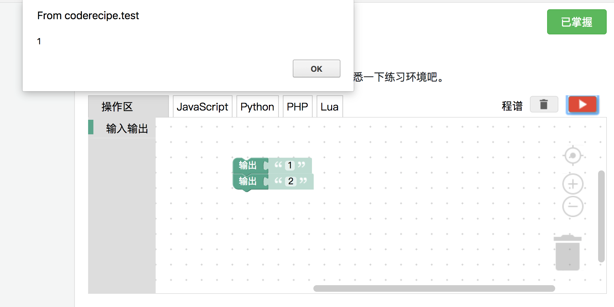

<notice>教程读者请不要直接阅读本文件，因为诸多功能在此无法正常使用，请移步至[程谱 coderecipe.cn](https://coderecipe.cn/learn/1)学习完整教程。如果您喜欢我们的教程，请在右上角给我们一个“Star”，谢谢您的支持！</notice>
选择判断
======

🌟你已经到到第二章啦，好棒！继续加油吧~

运行顺序
------
在没有复杂语句的情况下，计算机语句是会从上到下运行的。
比如我们把两个“输出”块上下连接起来，像下面这张图这样，那么上面的块会先被执行到。之后才会是下面的块，也就是会先输出1，再输出2。

你也可以在下面的练习环境里试一下：
<lab lang="blocks" parameters="logic=false&math=false&loops=false&lists=false&color=false&variables=false&functions=false&text=false&name=chapter2lab1">
  <notice>练习环境在此无法显示，请移步至[程谱 coderecipe.cn](https://coderecipe.cn/learn/1)查看。</notice>
</lab>

判断是不是
------
之前我们学的输入输出和计算已经可以派上很大用场了，但也有仅仅是输入输出和计算还不够用的情况。

比如我们想判断一个输入的数值合不合理，例如输入100以上则提示输入错误，这样就不能仅仅使用计算和输入输出做到了。

<!-- 比如当我们想做一个分数换算程序，将0到100的分数乘以1.5换算为0到150分。例如输入80分，输出就会是120分。

如果使用者每次输入的分数都正确，那这个程序没有什么问题，但如果使用者输入了一个错误的数字，比如在8之后多输入了一个0，成了800分，这样输出就会是1200分了。这显然是不合理的，而有没有办法可以判断出这种低于0或者高于100的情况呢？ -->

这就涉及到了计算机中“判断”的概念了。
下面这个实验环境多了一个“逻辑”功能，这里面其实就有我们判断所需要块，比如“如果”块。我们现在需要这个“如果”块和“=”块。首先我们把“=”块嵌入到如果块的右边，从“数学”功能组里面取出一个数字块（就是那个“0”块）放入左右两边，再在“执行”中放入一个输出语句就可以啦。

<lab lang="blocks" parameters="loops=false&lists=false&color=false&variables=false&functions=false&text=false&name=chapter2lab2">
  <notice>练习环境在此无法显示，请移步至[程谱 coderecipe.cn](https://coderecipe.cn/learn/1)查看。</notice>
</lab>

当然，如果要做成上面说的>100则提示输入出错效果，则需要再小小修改一下，这就交给大家去完成啦。可以点击下方内容对一下答案哦：
<cr type="hidden"><notice>隐藏内容功能在此无法正常显示，请移步至[程谱 coderecipe.cn](https://coderecipe.cn/learn/1)查看。</notice></cr>

如果…否则…
------
刚才我们有判断这个数字有没有超过100，如果超过了就会提示，那如果我们想让没有超过的时候提示“输入数字正确”，怎么做呢？

<lab lang="blocks" parameters="loops=false&lists=false&color=false&variables=false&functions=false&text=false&name=chapter2lab3">
  <notice>练习环境在此无法显示，请移步至[程谱 coderecipe.cn](https://coderecipe.cn/learn/1)查看。</notice>
</lab>

点击“如果”块左边的白色齿轮，在“如果”下面加上一个“否则”，这样就变成了“如果…否则”块。

接着，在否则里面添加一个“输入数字正确”的输出，就可以啦。✅

答案：
<cr type="hidden"><notice>隐藏内容功能在此无法正常显示，请移步至[程谱 coderecipe.cn](https://coderecipe.cn/learn/1)查看。</notice></cr>

更多种情况
------
如果我们想再让用户输入一次数值来验证一下，怎么办呢？

<lab lang="blocks" parameters="loops=false&lists=false&color=false&functions=false&text=false&name=chapter2lab4">
  <notice>练习环境在此无法显示，请移步至[程谱 coderecipe.cn](https://coderecipe.cn/learn/1)查看。</notice>
</lab>

细心的你可能已经看到了“否则如果”了。我们接下来就先添加一个“否则如果”块，然后嵌入“输入数字并提示消息”和“输出”块。程序会先判断“如果”块，如果这个判断是正确的，那么就执行“如果”块里面的内容，不然就判断“否则如果”，对的话就执行里面的内容，如果再不对，最后执行“否则”里面的内容。一个“判断”块整体可以有很多“否则如果”块，但只能有一个“如果”块和“否则”块。

但这样就需要用户输入两次一样的数字，就比较麻烦而且容易出错。其实我们可以先把这个数字存起来，这就需要用到“变量”功能，这个功能我们在下一章会细讲，敬请期待吧。😄

且与或
------
我们有的时候需要两个条件来进行判断，有时候我们需要两个条件同时满足的时候执行，有时候我们只需要两个条件其中的一个满足就可以执行了。这时候我们就可以用“且”块来帮我们做到这个工作。通过下拉框就可以把“且”换成“或”了。

偷懒的计算机——最小化求值原理
------
使用电脑的人总是希望电脑可以很快完成任务，设计电脑的工程师当然也是这样想的。因此计算机程序再运行的时候会自动排除一些不可能发生的情况，从而让电脑少算一些值来加快电脑运行的速度。

比如我们的程序需要判断100是不是等于200并且200是不是等于200，计算机在运算的时候，首先判断100是否等于200，当它发现100已经不等于200的时候，无论后面200是不是等于200，这整个判断都不可能是正确的。因此计算机就跳过了后面的判断，直接以这个判断的结果为不正确来处理。

同样，当我们的程序需要判断100是不是等于100或者200是不是等于300，计算机在运算的时候，首先看100是不是等于100，发现是的，那么无论后面200是不是等于300，整个判断都是对的，因此计算机也跳过了后面的判断，直接以这个判断的结果为正确来处理。

这个最小化求值原理看起来是计算机内部的一个小把戏，可有的时候也会影响到我们程序的运行。

比如当我们程序是这样的时候，如果我们第一次输入100，就不会有第二个框弹出来了（因为无论在第二个框里面输入什么，这个判断都是正确的）：

你也可以自己试一下怎么用“且”来体现计算机真的在“偷懒”：
<lab lang="blocks" parameters="loops=false&lists=false&color=false&variables=false&functions=false&text=false&name=chapter2lab5">
  <notice>练习环境在此无法显示，请移步至[程谱 coderecipe.cn](https://coderecipe.cn/learn/1)查看。</notice>
</lab>

不是的情况——“非”运算
------
有的时候我们想在两个数值不相等的情况下运行一些东西，这要怎么实现呢？
一个方法是，把执行留空，变成这样：

但这样并不实用，毕竟我们把“执行”留空了，而且这是最简单的情况，如果有“否则如果”，那情况就更加复杂了。其实还有另一种解决方案——“非”运算。

所谓的“非”运算就是把运算的结果反过来，也就是说，原来判断正确的现在会判断错误，原来判断错误的现在反倒会变成正确，对于相等判断，加上一个非运算就变成了不相等判断了。

所以刚才的情况就可以变成：

你也可以试一下其他含“非”运算的效果：
<lab lang="blocks" parameters="loops=false&lists=false&color=false&variables=false&functions=false&text=false&name=chapter2lab6">
  <notice>练习环境在此无法显示，请移步至[程谱 coderecipe.cn](https://coderecipe.cn/learn/1)查看。</notice>
</lab>

小练习
------
让我们来练习一下我们刚学习的知识吧。
<lab lang="blocks" parameters="loops=false&lists=false&color=false&variables=false&functions=false&text=false&name=chapter2lab7">
  <notice>练习环境在此无法显示，请移步至[程谱 coderecipe.cn](https://coderecipe.cn/learn/1)查看。</notice>
</lab>

试试做出如下的效果：

1. 如果输入（提示文字：101*101等于几）等于10201，输出“答案正确”，否则不输出
2. 如果输入的数字大于100，输出“输入的数字太大了”，不然输出“数字合适”
3. 连续输入两个数字，如果第一个是100，第二个是200，则输出“正确”，不然不输出
4. 如果输入的数字不等于100，输出“数字不正确”，否则不输出

学到这里，你就已经把第二章都学完啦，给你鼓鼓掌👏👏👏~
