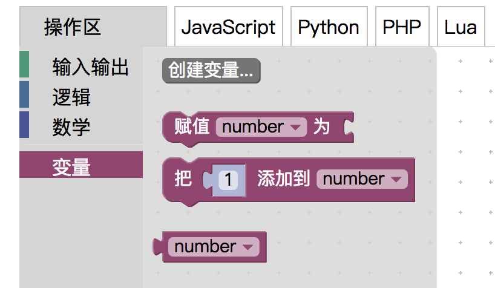
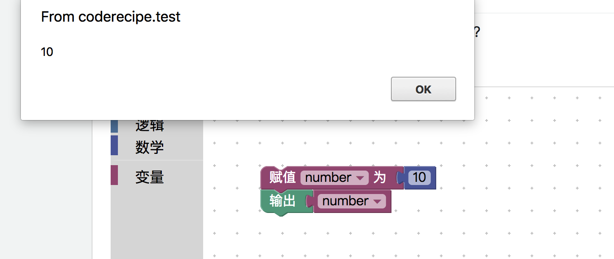
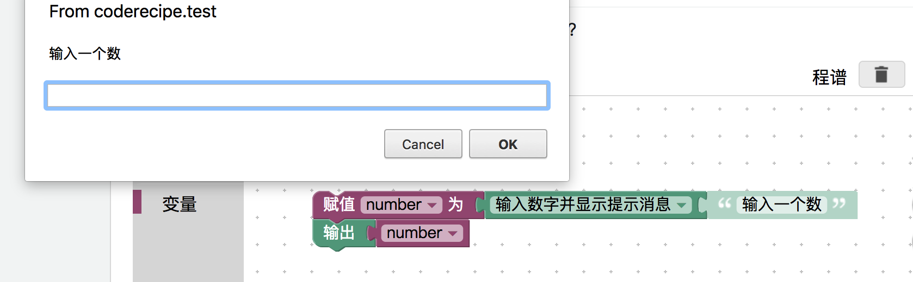
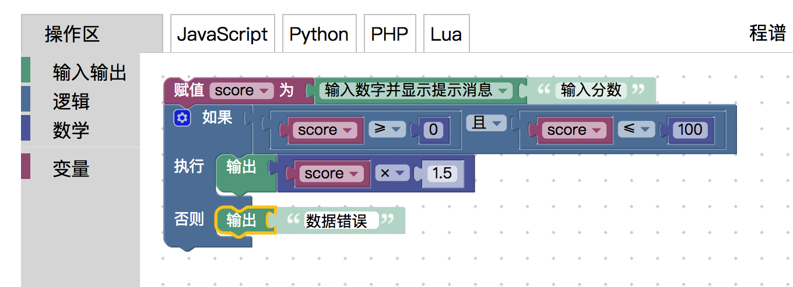
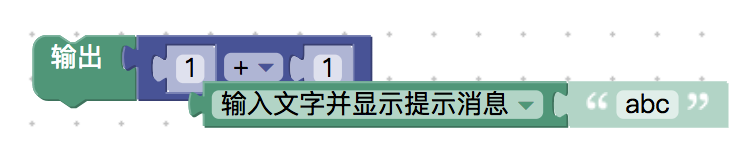

<notice>教程读者请不要直接阅读本文件，因为诸多功能在此无法正常使用，请移步至[程谱 coderecipe.cn](https://coderecipe.cn/learn/1)学习完整教程。如果您喜欢我们的教程，请在右上角给我们一个“Star”，谢谢您的支持！</notice>
变量和类型
======

🌟你已经到到第三章啦，让我们继续吧🌟

赋值和读取
------
在第二章里我们有简要提及变量这个概念，所谓的变量(variable)，就是可以改变的量，例如在程序运行的一开始这个量是1，后面可以变为2，到程序运行结束的时候可以变为100。在计算机中，我们可以把各种数据存储在变量中。

既然前面说了变量如此神奇，那么我们就需要知道变量的两个最基本的用法——赋值和读取。

所谓的赋值，就是给变量存一个值，比如我们把100存入一个变量（称为a），那么a里面就存着100这个数字。读取（或说取值）就更好理解了，相当于把这个值从变量里面取出来，如果我们取刚才所存的a变量，会得到一个100。

那么接下来我们就来试一下如何使用变量完成存取吧。

<lab lang="blocks" parameters="logic=false&math=false&loops=false&lists=false&color=false&functions=false&text=false&name=chapter3lab1">
  <notice>练习环境在此无法显示，请移步至[程谱 coderecipe.cn](https://coderecipe.cn/learn/1)查看。</notice>
</lab>

首先我们点击左边的“变量”组，然后点击“创建变量”来创建一个叫做“number”的变量。

接下来，我们先给这个“number”变量赋一个值10，然后我们输出“number”。

我们还可以修改一下这个，让变量从输入获取数值。

当然，除了数值，变量还可以储存文字，因此选择“输入文字并显示提示消息”也是可以的。

给变量起名字
------
我们刚才给储存数字的变量起名“number”，这是因为这个名字描述了变量里面储存的内容。一般我们用这几条规则来给变量起名：
1. 如果名称只有一个单词，那么这个变量名可以用这个单词的全小写形式（如“number”）
2. 如果名称由两个或两个以上个单词组成，那么变量名为第一个单词首字母小写，剩下的单词紧跟着第一个单词，但第一个字母大写（如学生数量为“studentNumber”）
3. 在变量名中，第一个位置不能是数字（如不能以“1Hello”作为变量名），不能有“-”、“/”等对计算机来说有歧义的符号（如“abc*def”会被计算机理解成abc乘以def），在大部分计算机语言中变量不能是系统保留用的关键字（比如Java编程语言里不能以“class”为变量名）

变量+选择
------
在上一章我们提到过“变量”这个概念，可以用变量来存储我们输入的数值方便我们进行多次判断而不需要重新获取。

比如当我们想做一个分数换算程序，将0到100的分数乘以1.5换算为0到150分。例如输入80分，输出就会是120分。

如果使用者每次输入的分数都正确，那这个程序没有什么问题，但如果使用者输入了一个错误的数字，比如用户一不小心成了800分，这样输出就会是1200分了。这显然是不合理的，而用之前的方法就需要用户输入两次分数，这样更繁琐了。有没有办法可以只输入一次判断出这种低于0或者高于100的情况呢？

一个解决方法如下：
1. 首先建立一个score变量，存入输入的数值
2. 判断输入的数值是不是大于等于0**并且**小于等于100
3. 是的话乘以1.5输出，不是的话输出“数据错误”

让我们来试一下吧：
<lab lang="blocks" parameters="loops=false&lists=false&color=false&functions=false&text=false&name=chapter3lab2">
  <notice>练习环境在此无法显示，请移步至[程谱 coderecipe.cn](https://coderecipe.cn/learn/1)查看。</notice>
</lab>

可以点下面的按钮显示参考解决方案：
<cr type="hidden"><notice>隐藏内容功能在此无法正常显示，请移步至[程谱 coderecipe.cn](https://coderecipe.cn/learn/1)查看。</notice></cr>

类型
------
大家可能会注意到以下这种情况：

当我们试着把“输入文字并显示提示消息”块拖动到“四则运算”块上的时候，这个块会自动弹开，但如果我们通过下拉框选择“输入数字并显示提示消息”再拖动上去时，就不会弹开了。

这其实是因为我们的运算操作都是有“类型”之分的，四则运算只能处理数字与数字之间的运算，而不能处理文字和数字或者文字与文字之间的运算。

如果我们选择“输入数字并显示提示消息”，然后再输入其他文字，得到的结果就会是NaN，如果选择“输入文字并显示提示消息”就不会有这样的情况。这是因为计算机在处理我们输入的文字时并转换成数字类型的时候，如果发现我们的输入不是一个数字，那么就会给出NaN。

大家也可以在这里试一试：
<lab lang="blocks" parameters="loops=false&lists=false&color=false&functions=false&text=false&name=chapter3lab3">
  <notice>练习环境在此无法显示，请移步至[程谱 coderecipe.cn](https://coderecipe.cn/learn/1)查看。</notice>
</lab>

小练习
------
让我们来练习一下我们刚学习的知识吧。
<lab lang="blocks" parameters="loops=false&lists=false&color=false&false&functions=false&text=false&name=chapter3lab4">
  <notice>练习环境在此无法显示，请移步至[程谱 coderecipe.cn](https://coderecipe.cn/learn/1)查看。</notice>
</lab>

试试做出如下的效果：

1. 如果输入一个大于100或者小于50的数字，则输出“数字范围不正确”，否则不输出
2. 如果输入“yes”或者“no”则对应输出“是”或者“否”，其他情况则输出“请输入yes或者no”
3. 把输入值保存在一个叫number变量，对这个变量平方三次（相当于把变量平方以后赋值给自己三次）输出
4. 试一试对“输入文字并显示提示消息”块进行数学运算，看能不能成功

学到这里，你就已经把第三章都学完啦 👏👏👏~
