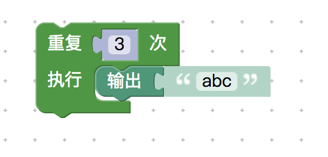
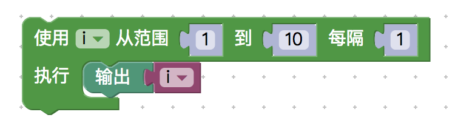
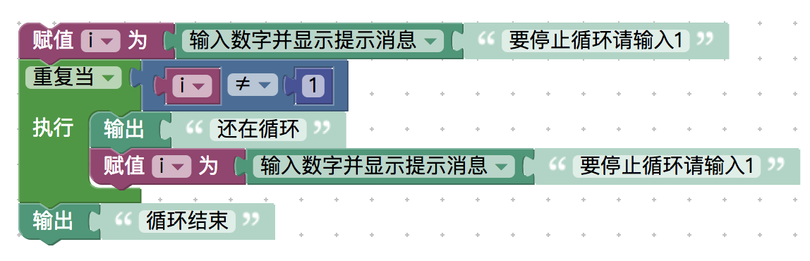

<notice>教程读者请不要直接阅读本文件，因为诸多功能在此无法正常使用，请移步至[程谱 coderecipe.cn](https://coderecipe.cn/learn/1)学习完整教程。如果您喜欢我们的教程，请在右上角给我们一个“Star”，谢谢您的支持！</notice>
循环
======

🌟你已经到了第四章啦，让我们继续吧🌟

次数循环
------
上次的练习题里面，我们给变量“number”进行了三次平方，并使用了三个一样的赋值语句。能不能简化这个过程呢？当然可以，这就是我们接下来要介绍的次数循环能做的了。

次数循环很容易理解，就是重复执行循环节里面的块数次，如下图所示的循环结构会输出三次abc。

可以自己试一试：
<lab lang="blocks" parameters="lists=false&color=false&functions=false&text=false&name=chapter4lab1">
  <notice>练习环境在此无法显示，请移步至[程谱 coderecipe.cn](https://coderecipe.cn/learn/1)查看。</notice>
</lab>

范围循环
------
范围循环也同样简单，在这里涉及到了一个变量的使用，下图这个循环的意思是，在第一次运行循环节的时候i是1，第二次的时候i会增加1，也就是变成2，以此类推直到最后一次循环i成为10为止。

所以最终这个“循环”块会输出1到10这10个数字。

你也可以自己试一试其他范围的循环：
<lab lang="blocks" parameters="lists=false&color=false&functions=false&text=false&name=chapter4lab2">
  <notice>练习环境在此无法显示，请移步至[程谱 coderecipe.cn](https://coderecipe.cn/learn/1)查看。</notice>
</lab>

当循环和直到循环
------
所谓的“当循环”，就是当右边的条件满足的时候一直循环下去，在下拉框里面我们还会发现一个“直到循环”，当右边的条件不满足的时候一直循环下去，直到条件满足循环才终止。

比如我们可以做一个小练习（提示：这个练习比较难），我们让用户输入一个数字，如果是1就停止循环并输出“循环结束”，如果不是1，就输出“还在循环”，并让用户重新输入数字，再来一次。

不过要小心，如果当循环中这个条件一直有效，或者直到循环一直不实现，就会导致无限循环。

<lab lang="blocks" parameters="lists=false&color=false&functions=false&text=false&name=chapter4lab3">
  <notice>练习环境在此无法显示，请移步至[程谱 coderecipe.cn](https://coderecipe.cn/learn/1)查看。</notice>
</lab>

下面是一个用“当循环”写的参考答案，你也可以试着用“直到”循环写写看：
<cr type="hidden"><notice>隐藏内容功能在此无法正常显示，请移步至[程谱 coderecipe.cn](https://coderecipe.cn/learn/1)查看。</notice></cr>

下一个循环和停止循环
------
如果我们想跳过当前循环内容，进行下一个循环，我们可以使用“下一个循环”功能，如果我们突然想结束这个循环，执行循环后面的内容，我们也可以使用“结束循环”功能。“结束循环”可以用来在当循环超过一定时间（比如变成无限循环）的时候跳出操作，这样就不会让程序一直在错误的状态下运行下去了。

因为在初学范围内，大部分的循环操作都可以用上面所说的几个循环结构做出，这里就不多介绍这两个功能块了。

小练习
------

试试用循环做出如下的效果：

1. 重复输入三次数值，然后输出这三个数字的和。
2. 让用户输入多个数值直到用户输入0为止，计算用户输入数值的平均值，如果用户第一个输入的就是0则输出0。
3. 计算0到100中奇数的个数
提示：
<cr type="hidden"><notice>隐藏内容功能在此无法正常显示，请移步至[程谱 coderecipe.cn](https://coderecipe.cn/learn/1)查看。</notice>相当于从第一个范围内的奇数开始每隔2向一个变量加1</cr>

4. 提示用户输入一个0到10之间的数字，只有输入5（正确答案）的时候才跳出循环，然后输出“答案正确”。

操作台：
<lab lang="blocks" parameters="lists=false&color=false&functions=false&text=false&name=chapter4lab4">
  <notice>练习环境在此无法显示，请移步至[程谱 coderecipe.cn](https://coderecipe.cn/learn/1)查看。</notice>
</lab>

学到这里，你就已经学完了几个程序的基本语句啦 👏👏👏~
