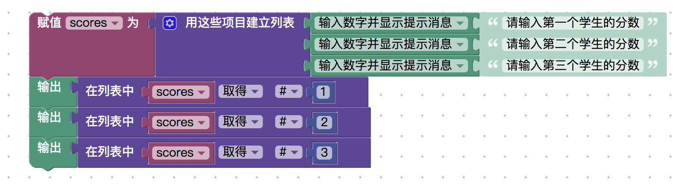
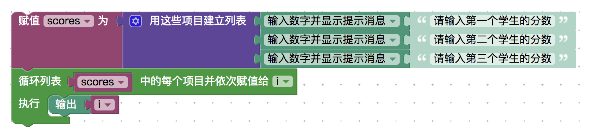
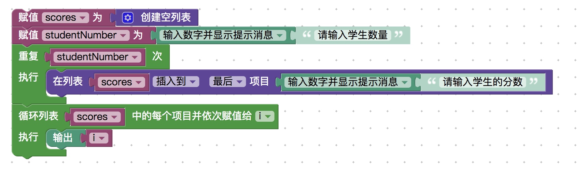

<notice>教程读者请不要直接阅读本文件，因为诸多功能在此无法正常使用，请移步至[程谱 coderecipe.cn](https://coderecipe.cn/learn/1)学习完整教程。如果您喜欢我们的教程，请在右上角给我们一个“Star”，谢谢您的支持！</notice>
列表
======

🌟第五章我们会学习一些不一样的东西哦🌟

列表的建立、取得和修改
------
比如我们现在有三个学生，学号分别为1、2、3，如果我们想让用户输入并记录这三个学生的分数，那么可以定义三个变量student1Score、student2Score和student3Score来储存，这样看起来很方便。

但假如我们要存的学生数量更多一些，比如如果我们有50个学生，那定义50个变量也就太麻烦了吧。再说，假如我们也不知道学生数量有多少，而是让用户在一开始先输入学生数量，定义变量的方式就失效了。

幸好我们有“列表”可以帮我们解决这个问题。我们可以把“列表”理解成一种特殊的类型，它同样需要赋值给变量进行储存。

我们就在下面这个操作台进行实验吧：
<lab lang="blocks" parameters="color=false&functions=false&text=false&name=chapter5lab1">
  <notice>练习环境在此无法显示，请移步至[程谱 coderecipe.cn](https://coderecipe.cn/learn/1)查看。</notice>
</lab>

先以三个学生的分数为例，我们先新建一个“scores”变量，并把一个列表赋值给它，列表的内容是三个“输入”块。之后在新建完以后分别取得列表的第1、2、3项并输出（“#”是第几项的意思，比如“#1”就是第一项）。

最后会成为这样：

点击运行之后输入三个数值，我们就会发现这个列表已经把我们的数值存了起来，而最终我们只用了一个变量。

当然，前面只用了“取得”这个功能，其实“设置”也是一样的，它会修改列表中的某个值。

循环+列表——遍历
------
刚才我们重复输出了三次数值，看起来有些繁琐，使用“列表循环”就可以解决这个问题。

所谓的“列表循环”，就是对一个列表中的每一项都执行一次循环的内容（也叫“遍历”），在执行前，把执行到的那一项赋值给一个变量。

比如如下的这个功能和上面的就完全一样：

上面的这个“循环列表”会对列表中的每一个项目执行一次输出语句，在执行输出语句之前，先把这一次执行的内容赋值给变量i。因此我们输出i时，输出的就是这个列表里面所有的内容。

你也可以亲自试一下：
<lab lang="blocks" parameters="color=false&functions=false&text=false&name=chapter5lab1">
  <notice>练习环境在此无法显示，请移步至[程谱 coderecipe.cn](https://coderecipe.cn/learn/1)查看。</notice>
</lab>

循环+列表——遍历
------
刚才我们重复输出了三次数值，看起来有些繁琐，使用“列表循环”就可以解决这个问题。

所谓的“列表循环”，就是对一个列表中的每一项都执行一次循环的内容（也叫“遍历”），在执行前，把执行到的那一项赋值给一个变量。

比如如下的这个功能和上面的就完全一样：

上面的这个“循环列表”会对列表中的每一个项目执行一次输出语句，在执行输出语句之前，先把这一次执行的内容赋值给变量i。因此我们输出i时，输出的就是这个列表里面所有的内容。

你也可以亲自试一下：
<lab lang="blocks" parameters="color=false&functions=false&text=false&name=chapter5lab1">
  <notice>练习环境在此无法显示，请移步至[程谱 coderecipe.cn](https://coderecipe.cn/learn/1)查看。</notice>
</lab>

加长列表
------
之前我们有说，用列表可以解决学生数量是不确定的问题，那具体怎么操作呢？因为我们知道这个列表的长度不是固定的，因此我们就需要加长列表了。

首先我们建立一个空列表，然后问用户有多少个学生，再让用户输入学生的分数并插入到列表的末端，最后依次输出。这个“插入到”块显得比较隐蔽，要在“设置”块里面用下拉框才能看得到。

你可以先试着做做看：
<lab lang="blocks" parameters="color=false&functions=false&text=false&name=chapter5lab1">
  <notice>练习环境在此无法显示，请移步至[程谱 coderecipe.cn](https://coderecipe.cn/learn/1)查看。</notice>
</lab>

参考答案：
<cr type="hidden"><notice>隐藏内容功能在此无法正常显示，请移步至[程谱 coderecipe.cn](https://coderecipe.cn/learn/1)查看。</notice></cr>

小练习
------
试试用列表做出如下的效果：

1. 输入三段文字，原样输出
2. 输入三个数字，原样储存在一个列表里后，再修改这个列表里的项目，给列表里的每个项目加1，最后输出出来
3. 输入三个数字，输出它们的和
4. 输入三段文字，倒序输出

提示：
<cr type="hidden"><notice>隐藏内容功能在此无法正常显示，请移步至[程谱 coderecipe.cn](https://coderecipe.cn/learn/1)查看。</notice>倒序输出可以理解为在列表里倒序储存，也就是每一次插入都插入到列表的最前面而不是最后面</cr>

学到这里，你就已经学完了前5章的内容啦 👏👏👏~
