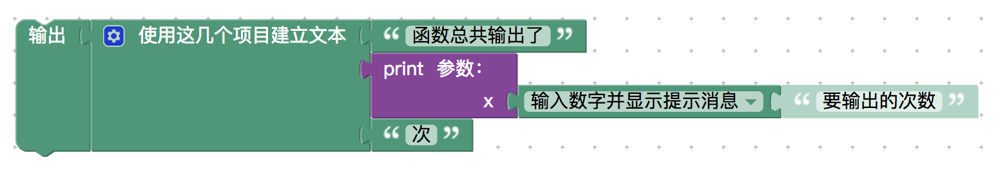

<notice>教程读者请不要直接阅读本文件，因为诸多功能在此无法正常使用，请移步至[程谱 coderecipe.cn](https://coderecipe.cn/learn/1)学习完整教程。如果您喜欢我们的教程，请在右上角给我们一个“Star”，谢谢您的支持！</notice>
函数
======

🌟哇你学到最后一章啦！坚持就是胜利，把它学完吧！🌟

函数与返回值
------
计算机中的“函数”和数学中的“函数”很像，所以如果学过数学函数，理解计算机就不是什么难事了。如果没有学过也不要紧，我们会从头开始给大家介绍计算机函数的概念。

在计算机的函数(function)中，我们会给计算机一个或者几个输入值（参数），然后计算机进行运算，最后给出一个结果（返回值）。不过和数学里的“函数”不同，计算机里函数不只是用来运算，而且可以执行操作，比如我们可以在函数里输出文字。

让我们在操作台里边做边学吧。

<lab lang="blocks" parameters="color=false&name=chapter6lab1">
  <notice>练习环境在此无法显示，请移步至[程谱 coderecipe.cn](https://coderecipe.cn/learn/1)查看。</notice>
</lab>

比如我们可以建立一个函数print，用来输出“1”、“2”、“3”。那么就可以这么定义一个函数：

大家可以看到这个函数块的底下没有“返回”，是因为我们不需要告诉使用我们函数的代码块我们函数执行的情况（不需要给返回值）。

使用这个函数也很简单，我们把它当普通的块来使用就好了，比如我们可以这么使用：

那如果我们想告诉使用我们“print”函数的那个块3这个数字，代表我们输出了3次，怎么做呢？

<lab lang="blocks" parameters="color=false&name=chapter6lab2">
  <notice>练习环境在此无法显示，请移步至[程谱 coderecipe.cn](https://coderecipe.cn/learn/1)查看。</notice>
</lab>

这次我们使用有“返回”的函数块，把“3”连接到返回上。然后会发现我们的“print”函数左边可以插到“输出”块上，大家可以发现左边多了一个“文本”组，这是帮我们组合处理文本使用的，我们可以把我们的输出数值加到文本里。最后就像下面这张图这样：

参数
------
如果我们不仅仅想让这个函数固定输出三次，而是想告诉这个函数输入的次数呢？这就需要用到参数了。

可以在这里进行操作：
<lab lang="blocks" parameters="color=false&name=chapter6lab3">
  <notice>练习环境在此无法显示，请移步至[程谱 coderecipe.cn](https://coderecipe.cn/learn/1)查看。</notice>
</lab>

拖动一个函数块，点击左边的齿轮，再添加一个叫“x”的输入，最后在函数里面使用范围循环每隔1输出1到x的数字。就像下面这张图这样：

使用这个函数也很简单，只需要在右边插入“x”对应的数值就可以了。

小练习
------
试试用函数做出如下的效果：

1. 定义一个能输出三段文字的函数，用循环调用这个函数3次。
2. 定义一个能从参数读取三个数字并返回它们的平均数的函数，并试着调用这个函数。
3. 定义一个能计算三次方的函数，并用这个函数做一个三次方计算器。

操作台：
<lab lang="blocks" parameters="color=false&name=chapter6lab4">
  <notice>练习环境在此无法显示，请移步至[程谱 coderecipe.cn](https://coderecipe.cn/learn/1)查看。</notice>
</lab>

学到这里，你就已经学完了计算机的基础概念啦，接下来我们有一章帮助你更好的衔接今后的学习 👏👏👏~
